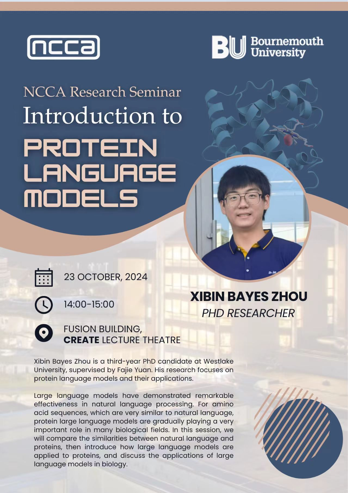

# Introduction to Protein Language Models

Abstract: Large language models have demonstrated remarkable effectiveness in natural language processing. For amino acid sequences, which are very similar to natural language, protein large language models are gradually playing a very important role in many biological fields. In this session, we will compare the similarities between natural language and proteins, then introduce how large language models are applied to proteins, and discuss the applications of large language models in biology.

This is the poster:

